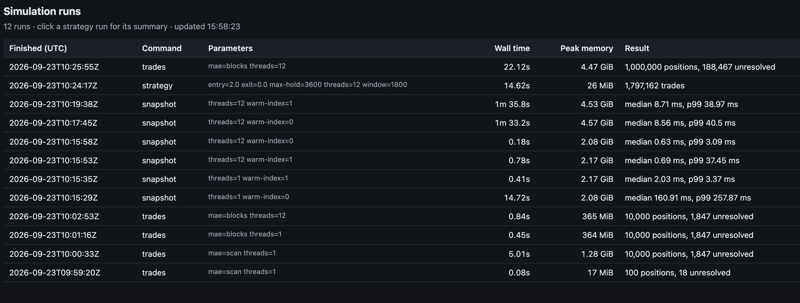

# Second-Resolution Equity Simulator

Generator, storage layer, simulator and dashboard for one quarter of one-second prices
(2,000 instruments: 1,000 US, 500 Europe, 500 Japan; about 2.88 billion points).

## Build

```
./build.sh test                       # build gen, ingest, sim into this directory and run the tests
./build.sh                            # build only
```

## Run

```
# 1. Generate raw data (shorten --start/--end for a quick check; full quarter for real numbers)
./gen --out raw/ --seed 20250101 --start 2025-01-02 --end 2025-03-31 --config region.yaml

# 2. Ingest raw/ into an instrument-major store
./ingest --raw raw/ --store store/ --config region.yaml --stride 256 --threads 12

# 3. Sample trades.csv / timestamps.txt to exercise sim trades/snapshot without hand-writing input
python3 bench/make_inputs.py --out data/ --trades 1000000 --snapshots 10000 --instruments 2000 --seed 20250101

# 4. Run the simulator
./sim trades   --store store/ --in data/trades.csv     --out results/results.csv --threads 12 --mae blocks
./sim snapshot --store store/ --in data/timestamps.txt --out results/snapshot.bin --threads 12 --warm-index 1
./sim strategy --store store/ --reverters raw/reverters.txt --window 1800 --entry 2.0 --exit 0.0 \
               --max-hold 3600 --out strategy_out/trades.csv --summary strategy_out/summary.csv --threads 12

# 5. Dashboard — polls runs.jsonl and updates itself as runs finish
python3 dashboard/serve.py --log runs.jsonl --port 8000   # http://127.0.0.1:8000
```

Every `sim` run appends one JSON line (parameters, wall time, peak RSS, result) to
`runs.jsonl` (`--runlog FILE|none`); the dashboard polls that file every 2s.



## Store layout

Raw data is grouped by day then instrument. Strategy runs and position pricing read one
instrument over a long time range; snapshots read every instrument at one instant. The
store is grouped by instrument.

| file | contents |
|---|---|
| `data.db` | every instrument's records (16 B: int64 ns, float32 price, int32 volume), instrument after instrument, each time-sorted; each instrument starts on a 64 KiB boundary |
| `index.idx` | header; per-instrument table `{first record, count, first block}` indexed by id (no search); per block of 256 records: first timestamp, and min/max price of the block |
| `segments.idx` | region names, and per instrument its calendar sessions ("segments") with UTC bounds, record range and local trading date |

* **Lookups** (`store.h`): binary search the instrument's block timestamps (dense array, small),
  then binary search inside one 256-record (4 KB) block. "Last price at or before t" and
  "first record at or after t" both work this way, across day and segment boundaries.
* **Segments come from the calendar, not from gaps in the data.** A dropped second (0.5%) looks
  like a gap; a segment end does not. Ingest reads `region.yaml` (session hours, DST, holidays;
  the same code as the generator) so `sim` needs no config.
* **Max adverse excursion** needs only the lowest (long) or highest (short) price in the holding
  period, so the index keeps min/max per block: a multi-day hold reads two ragged block ends
  instead of every record. `--mae scan` is the plain read-everything baseline.
* **Strategy** streams each segment with `pread` into a per-thread buffer rather than touching a
  46 GB mapping, so peak resident memory stays small. The trailing window is a ring buffer with running
  sum / sum of squares (O(1) per second), shifted by the segment's first price for numerical
  stability.
* **Ingest** runs instruments in parallel from a pass-1 stat of every raw file, so every output
  position is known up front. Per-instrument regions of `data.db` are page-aligned and the index
  is written by one thread (see "Challenges").

## Assumptions

Where the assignment is open (also the ones in `assumptions.txt` for the generator):

* **Snapshot/last-known-price:** the last record with timestamp `<=` t; NaN before an instrument's first record. Output is raw
  `float32[N][2000]`, row-major, no header; instruments not in the store are NaN.
* **Trades:** entry snaps forward to the first record `>=` entry, exit snaps backward to the last record `<=` exit; status 1 (empty numbers)
  if either is missing or exit < entry after snapping. Equal timestamps are fine.
* **Max adverse excursion** is in money, like pnl: `quantity x` the largest per-unit loss against the entry price over
  every recorded second in `[entry, exit]`, floored at 0.
* **Strategy window:** the last `W` *recorded* prices in the segment, current one included; signals start once
  `W` prices exist. Because dropped seconds do not create slots, a window spans slightly more than `W` clock seconds.
* **Max hold** is wall-clock: exit when `ts - entry_ts >= max_hold` seconds. Exit checks (z, hold, segment end) all happen at
  the current second, so precedence does not change any price or time.
* z uses population std; if the window has zero variance there is no signal (an open position can still leave by max hold or
  segment end). No position is opened on a segment's last recorded second (it would close immediately at the same price).
* **Sharpe** uses every local trading day of the region in the store (days with no exits count as 0), sample std, `x sqrt(252)`.
  A group with no trades prints `nan` for Sharpe, count 0 and pnl 0.
* Trade CSV numbers are the shortest text that round-trips (float32 prices, float64 pnl).

## Challenges

* **A concurrent-write race in ingest that only shows at scale.** The first full ingest passed all tests and
  a spot check, but 350 of 2,000 instruments had zeroed records at their start. Neighbouring instruments shared
  a 4 KB page in `data.db`; two threads writing different byte ranges of one page in a freshly extended (sparse)
  file lost an update. Every bad run started at an instrument's first record and ended on a 4 KB boundary, which
  identified it. The fix: instrument regions start on 64 KiB boundaries, index slices are built in memory and written by
  one thread. Regression checks: an alignment invariant test, an optional `--verify` read-back in ingest, and
  `bench/verify_store.py`, an independent numpy checker (data, index, block ranges, alignment) that passed on the full quarter.
* **Snapshots are disk-bandwidth bound.** See the benchmark notes below.

## Tests

`ctest` (or `./build.sh test`): `test_generator`, `test_ingest` (hand-built store, bracket boundaries at strides
4/5/256, calendar segments against hand-computed UTC times, block min/max), `test_sim` (hand-computed trades incl. weekend
and Tokyo-lunch cases; snapshots incl. NaN; strategy on a 10-price segment with exact entries/exits/pnl; two parameter sets;
strategy vs a from-scratch reimplementation of the spec on generated data; block-index MAE vs scan vs brute force).

## Benchmarks

Apple M-series laptop, 12 cores, internal SSD, full quarter (2,884,406,697 points, raw ~43 GiB / 46.1 GB).
Inputs: `bench/make_inputs.py` (1M positions, 10k timestamps).

| | result |
|---|---|
| Generate full quarter (2,000 instruments) | 234.5 s |
| Ingest, 1 thread | 156.8 s |
| Ingest, 12 threads, stride 256 | 73.8 s, store 46.43 GB = **16.10 B/point** (raw is 16; index and 64 KiB padding are the extra) |
| 1M positions, block-index MAE, 12 threads | 22.0 s, 4.58 GiB peak RSS (18.8% unresolved: entry/exit in a gap or beyond the data) |
| 10k positions, plain scan MAE (baseline), 1 thread | 5.01 s, 1.28 GiB peak |
| 10k positions, block-index MAE, 1 thread | 0.45 s, 364 MiB peak — identical output, ~11x faster than scan at this scale |
| 10,000 snapshots, 12 threads, warm index | median **8.71 ms**, p99 **38.97 ms**, max 233 ms, 4.64 GiB peak |
| 100 snapshots, 1 thread, cold index | median 160.9 ms, p99 257.9 ms |
| 100 snapshots, 1 thread, warm index | median 2.03 ms, p99 3.37 ms — warming the index removes most of the cold-start cost at this scale |
| Strategy W=1800 entry=2 exit=0 hold=3600, 12 threads | 14.62 s, 1,797,162 trades, **26 MiB** peak RSS |

Strategy, W=1800 entry=2 exit=0 hold=3600 (Sharpe): US reverters 36.1, other 1.8; Europe 28.4 / -0.7; Japan 18.8 / -4.1.
Reverters are clearly positive and the rest is noise (about +/-2 standard error over ~60 days), as the assignment predicts.

**Where the snapshot p99 comes from.** A snapshot is 2,000 independent lookups, each a random ~16 KB page of a 46 GB file.
On a cold index, a single thread costs tens of us per lookup just on index page faults (100-snapshot, 1-thread, cold-index
median above); 12 threads pushing 10,000 snapshots reach ~8.7 ms median but a p99 near 39 ms, because that tail is queueing
on the SSD, not the search. It does not get much faster on a second run either (10,000 snapshots touch far more data than
fits in RAM). Getting the tail down needs fewer bytes read per snapshot, i.e. a time-major layout, not a faster lookup.

Peak RSS for `snapshot` and `trades` (1-5 GB) is mostly mapped file pages that the kernel can drop; `strategy` uses `pread` and stays near 30 MB.
